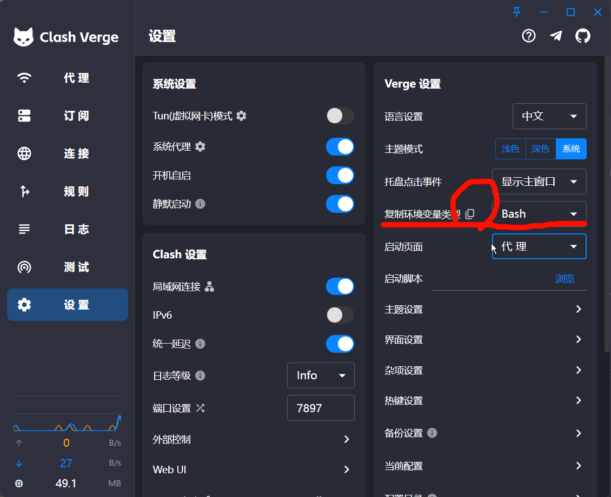

## 霍格沃兹环境

### 工作原理：

首先，简单科普一下上网的原理。一般情况下，我们访问网页时，只需要在浏览器中输入网址，就可以直接访问到目标内容。


某些资源可能因为地域限制、网络防火墙等原因无法直接访问。这时，我们就需要借助**代理服务器**。代理服务器充当了中间人的角色，帮助我们访问被限制的资源。整个过程变成如下图所示：


我们俗称的科学上网实际上指的就是第二种过程。

### 代理软件：

为了实现科学上网，通常需要使用代理软件，它们能够帮助我们设置代理服务器并进行连接。常见的代理软件包括：

1. [v2rayN](https://github.com/2dust/v2rayN/releases) ：基于 V2Ray 协议的 Windows 客户端。
2. [Clash-verge-rev](https://github.com/Clash-Verge-rev/clash-verge-rev/releases) ：基于 Clash 的客户端，支持windows、Linux，并且默认有中文，比较推荐。
3. [Clash_for_Windows](https://github.com/clashdownload/Clash_for_Windows/releases) ：Clash 的 Windows 客户端，同时也支持Linux、Android

这些软件通过经典的“枪弹分离”工作方式，即软件本身不直接提供代理服务，而是通过特定的**配置文件**与代理节点配合使用。配置文件中的重要部分就是**机场**信息。

### 机场:

**机场**是指一些提供翻墙服务的代理节点或代理服务商，通常这些服务商会提供包含多个节点（即代理服务器）信息的配置文件，这些服务器会遍布世界各地，因此可以访问全球大部分资源。

购买机场服务后，通常会获得一个配置文件下载链接。导入代理软件后，就可以使用这些节点。

寻找好用的机场可以直接搜索”**机场推荐**“，在GitHub上会有很多评测，进去根据自己的需求寻找合适的就好。

选择原则：

1. 节点数量与地区分布：节点越多，覆盖的地区越广，访问速度和稳定性会更好。
2. 带宽和流量限制：小水管带宽不建议使用，很影响体验，一般选择几百兆的就很舒服，千兆日常也不可能跑满；流量一般是一个月限制使用多少，一般100G根本用不完。
3. 设备数量：部分机场会限制同时连接的设备数量。
4. 流量计算是否翻倍：坑点，一些机场会对流量进行加倍计算，比如美国节点流量 x5，即5倍计算消耗的流量。
5. 老牌还是新建机场：老牌机场一般比较稳定，跑路的可能性小，但是价格相对较贵。新建机场比较便宜，但是有网络波动、厂商跑路的风险。

### 操作演示：

下面以Clash-verge和[飞鸟机场](https://github.com/winston779/flyingbird)进行演示。安装软件和注册机场账号不再赘述。

进入机场管理页面：


在商店中选择自己需要的套餐，购买后点击复制链接：


打开安装好的Clash-verge，进入订阅页面，在上方的导入链接中粘贴刚才复制的内容：


在设置界面打开系统代理：


进入代理页面，选择一个节点就可以正常使用：


### 三种代理模式：

**规则模式**：按照下载的配置文件，只代理无法正常访问的内容。例如百度、哔站等不经过代理，Youtube、GitHub经过代理。日常保持在这个模式就好。

**全局模式**：所有流量都经过代理

**直连模式**：所有流量都不经过代理

另外还有高级的**Tun 模式**，会在系统产生一个虚拟网卡，所有流量都经过这个网卡，实现全局代理，特殊情况会有用。

### Linux系统注意点：

Linux系统没有Windows下使用方便，通常需要进行一些配置，例如，虽然打开了代理软件，但是在终端中仍然无法 成功`git clone https://github.com/xxx`。因为Linux实现终端中代理需要配置一些环境变量。

这个操作Clash-verge已经替我们考虑到，进入设置界面点击复制环境变量，将内容粘贴到.bashrc文件中即可：



```shell
# 配置代理环境变量
export HTTP_PROXY="http://127.0.0.1:7897"
export HTTPS_PROXY="http://127.0.0.1:7897"
```

## 其他注意点

- 大部分机场只能代理 `http`、`https`流量，复制GitHub链接时，不要选择SSH协议


